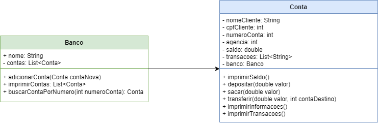

## ATIVIDADE 1 - COMENTANDO FRASE DO LIVRO ...

We see three critical differences between programming and software engineering: time, scale, and the trade-offs at play. On a software engineering project, engineers need to be more concerned with the passage of time and the eventual need for change. In a software engineering organization, we need to be more concerned about scale and efficiency, both for the software we produce as well as for the organization that is producing it. Finally, as software engineers, we are asked to make more complex decisions with higher-stakes outcomes, often based on imprecise estimates of time and growth.

Num projeto de engenharia de sosftware é essencial que o engenheiro de atenção maior a escala do software a ser desenvolvido, as estimativas do tempo necessário para o seu desenvolvimento e também se o método adotado para o desenvolvimento é realmente eficiente para o tipo de sistema que está sendo desenvolvido, mantendo-se sempre alerta as mudanças necessárias para atingir o melhor resultado

## ATIVIDADE 2 - COMENTANDO TRADE-OFFS ...
### Java x Python:

- escalabilidade: Python pode ser mais pesado, quando se trata da memória e is, so pode acabar afetando a escalabilidade de um sistem. Outro ponto é que sua escalabilidade só pode ser feita horizontalmente. Já quando se trata da linguagem Java, sua escalabilidade pode ser mais eficiente para grandes sistemas, pois também é possivel escala-la verticalmente devido à sua gestão avançada de threads e desempenho.

- usabilidade: Quando se trata do desenvolvimento e prototipagem, Python pode ser mais vantajoso pelo fato de possuir uma sintaxe e legibilidade simples, o que pode acelerar o processo. Java possui uma sintaxe e regras rigorosas, que acabam tornando o processo de desenvolvimento mais lento do que com o Python.

### NoSQL x SQL:

- escalabilidade: Bancos de dados SQL são tradicionalmente escalados verticalmente, escala-los horizontalmente exige práticas complexas, tornando o processo mais dificultoso. Banco de dados NoSQL foram desenvolvidos para escalarem horizontalmente, distribuindo cargas em diferente servidores de forma mais eficiente.

- usabilidade: Bancos de dados SQL são recomendados quando  precisamos tratar de dados estruturados e relacionamentos complexos, também é uma rica linguagem de consulta. Bancos NoSQL são mais flexiveis em relação a esquemas e lidam melhor com dados não estruturados em comparação ao SQL.

### Linux x Windows:

- usabilidade: Linux é mais complexo de utilizar, pois não possui uma interface gráfica, e seu uso é feito em maior parte por linhas de código no terminal, porém é gratuito e a maior parte de seu softwares também são. O Windows possui uma interface gráfica clara e intuitiva, tornando seu uso mais simples que Linux, porém sua licensa é paga e muitos de seus softwares possuem custo adicional.

- desempenho: Como o sistema operacional Linux, não possui uma interface gráfica, isso acaba o tornando mais veloz em comparação ao windows, a interface gráfica utiliza recursos do sistema e isso acaba deixando o processamento lento.

## ATIVIDADE 3 ...

## ATIVIDADE 4 ...
- Nessa atividade desenvolvi a UML para um projeto que representaria um banco, onde podemos ver os objetos Conta e Banco, seus respectivos atributos e métodos;

- UML:


- Classe Conta:
  
```java
package models;

import java.text.DecimalFormat;
import java.util.List;

public class Conta {

    //	atributos
    private String nomeCliente;
    private String cpfCliente;
    private int numeroConta;
    private int agencia;
    private double saldo;
    private List<String> transacoes;
    private Banco banco;

    //    auxiliares
    private int sequencial = 1;

    //    constructor
    public Conta(String nomeCliente, String cpfCliente, Banco banco) {
        this.nomeCliente = nomeCliente;
        this.cpfCliente = cpfCliente;
        this.numeroConta = sequencial++;
        this.agencia = 1;
        this.saldo = 0.00;
        this.banco = banco;
    }

    //	metodo para imprimir todas as informações
    public void imprimirInformacoes() {
        System.out.println("=========== INFORMAÇÕES DE " + nomeCliente.toUpperCase() + " ===========");
        System.out.println("NOME DO CLIENTE: " + nomeCliente);
        System.out.println("CPF DO CLIENTE: " + cpfCliente);
        System.out.println("SALDO DA CONTA: " + saldo);
        System.out.println("NUMERO DA CONTA: " + numeroConta);
        System.out.println("NUMERO DA AGÊNCIA: " + agencia);
        System.out.println("NOME DO BANCO: " + banco);
        System.out.println("=====================================================");
    }

//    metodo para imprimir o saldo
    public void imprimirSaldo() {
        System.out.println("=========== SALDO DE " + nomeCliente.toUpperCase() + " ===========");
        System.out.println("SALDO DA CONTA: R$" + saldo);
        System.out.println("=====================================================");
    }

//    metodo para depositar um valor
    public void depositar(double valor) {
        saldo += valor;
    }

//    metodo para sacar um valor
    public void sacar(double valor) {
        if(valor>saldo) {
            System.out.println("SALDO INSUFICIENTE");
        } else {
            saldo -= valor;
        }
    }

//    metodo para retornar o numero da conta
    public int getNumeroConta() {
        return numeroConta;
    }

    //    metodo para transferir um valor de uma conta para outra
    public void transferir(double valor, Conta contaDestino) {
        if(valor <= saldo) {
            this.sacar(valor);
            contaDestino.depositar(valor);
        } else {
            System.out.println("SALDO INSUFICIENTE");
        }
    }
}
```

- Classe Banco:

```java
  package models;

import java.util.ArrayList;
import java.util.List;

public class Banco {
//    atributos
    public String nome;
    private List<Conta> contas;

//    constructor
    public Banco(String nome) {
        this.nome = nome;
        this.contas = new ArrayList<>();
    }

//    metodo toString
    @Override
    public String toString() {
        return "Banco{" +
                "contas=" + contas +
                '}';
    }

//    metodo para adicionar uma conta ao banco
    public void adicionarConta(Conta contaNova) {
        contas.add(contaNova);
    }

//    metodo para imprimir contas
    public  void imprimirContas(){
        System.out.println(contas);
    }

//    metodo para buscar uma conta por número
    public Conta buscarContaPorNumero(int numeroConta ){
        Conta contaEncontrada = null;
        if(!contas.isEmpty()){
            for(Conta conta : contas){
                if(conta.getNumeroConta() == numeroConta){
                    contaEncontrada = conta;
                }
            }
        } else {
            throw new RuntimeException("Não existe nenhuma conta cadastrada nesse banco");
        }
        return contaEncontrada;
    }
}
```

- Classe main para testes:
  ```java
  import models.Banco;
  import models.Conta;

  public class Main {
    public static void main(String[] args) {
  //        instanciando um novo objeto Banco
          Banco santander = new Banco("Santander");
  
  //    instanciando novos objetos Conta
          Conta joao = new Conta("Joao", "123456789", santander);
          Conta maria = new Conta("Maria", "987654321", santander);
  
  //        adicionando as contas ao banco
          santander.adicionarConta(joao);
          santander.adicionarConta(maria);
  
  //        imprimindo as informações das contas
          joao.imprimirInformacoes();
          maria.imprimirInformacoes();
  
  //        depositando nas contas
          joao.depositar(350);
          maria.depositar(200);
  
  //        imprimindo saldos pós depósito
          joao.imprimirSaldo();
          maria.imprimirSaldo();
  
  //        sacando das contas
          joao.sacar(50.00);
          maria.sacar(3000.00);
  
  //        imprindo saldo pós saque
          joao.imprimirSaldo();
          maria.imprimirSaldo();
  
  //        realizando transferencia de joão para maria
          joao.transferir(100.00, maria);
  
  //        imprimindo saldo pós transferencia
          joao.imprimirSaldo();
          maria.imprimirSaldo();
  
  //    exibindo contas no banco
          santander.imprimirContas();
      }
  }
  ```
